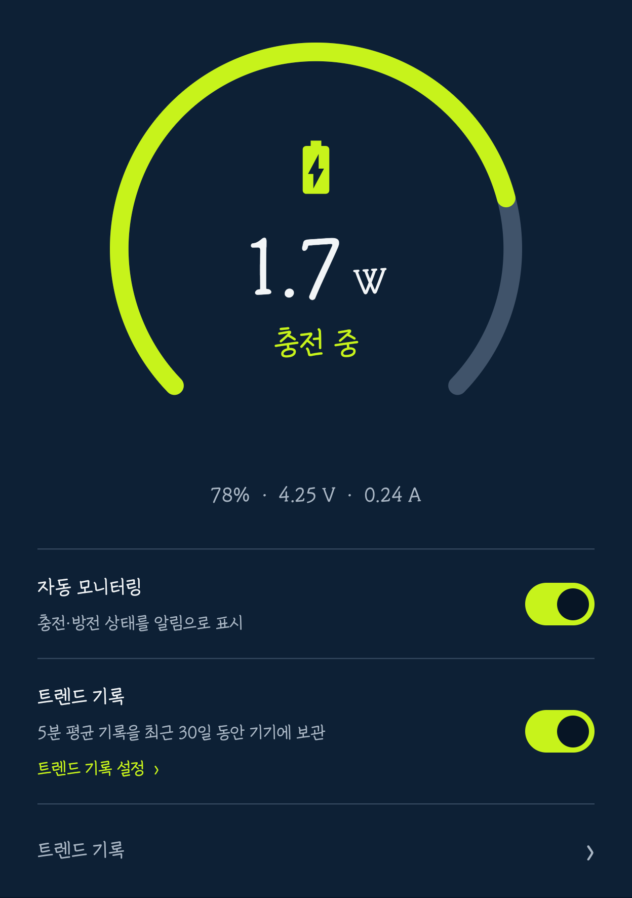
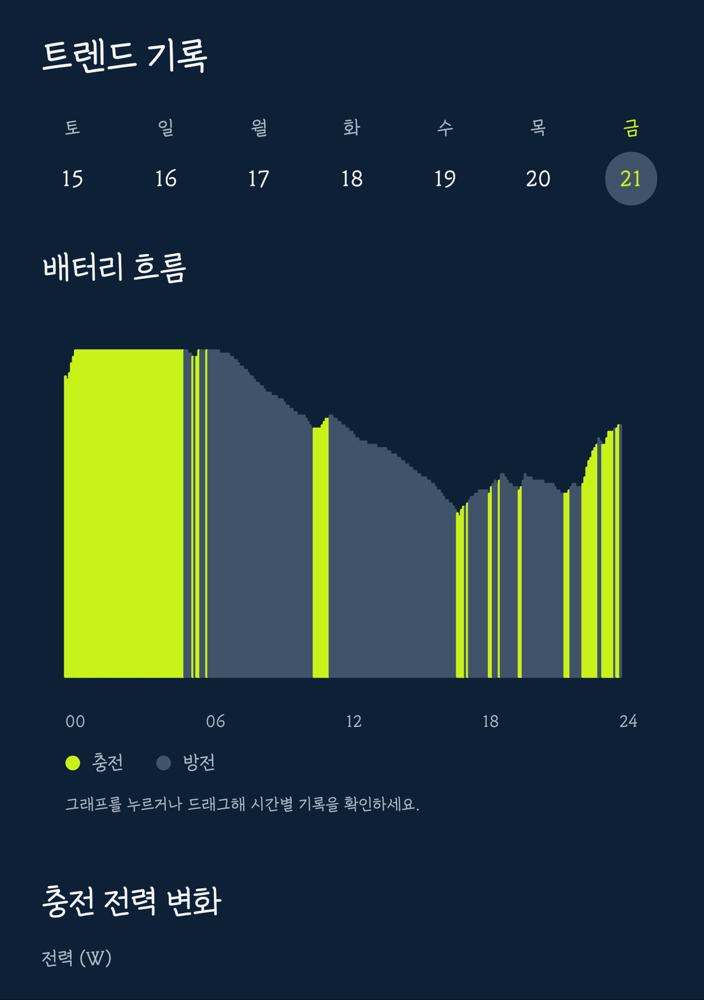
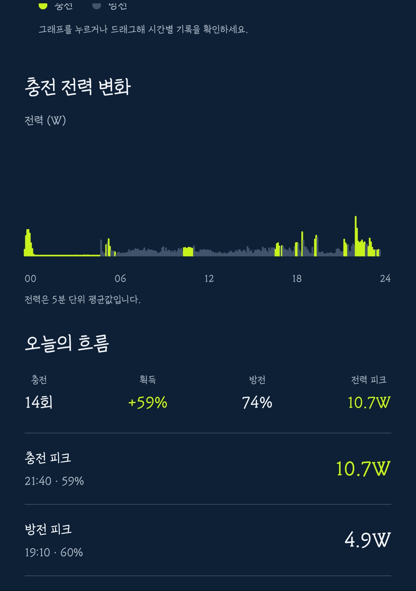
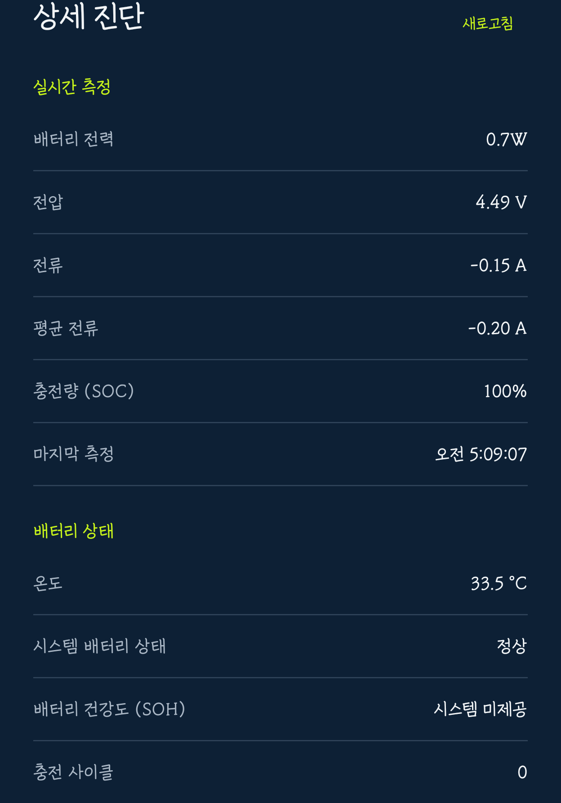
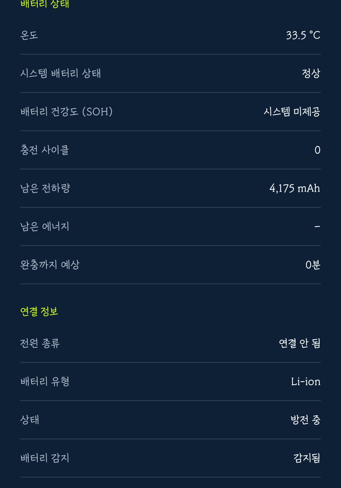

# Charge Monitor

> 한국어와 English 문서를 함께 제공합니다. 주요 내용은 두 언어로 바로 이어서 읽을 수 있고, 전체 문서는 `docs/`와 `docs/en/`에서 같은 번호로 찾을 수 있습니다. 
> Korean and English documentation is available. Core information is paired below, and complete documents use matching numbers in `docs/` and `docs/en/`.

Android 14 이상에서 배터리 전압·전류를 읽어 충전·방전 전력(W)을 계산하는 Android 앱입니다. 지속 알림과 빠른 설정 타일에서 현재 상태를 확인하고, 기기 내부에 보관한 최근 30일 기록으로 00~24시 배터리 흐름·충전 전력 변화·방향별 피크를 살펴볼 수 있습니다.

Charge Monitor is an Android 14+ battery power monitor. It reads battery voltage and current to estimate charging or discharging power in watts, shows the live state in an ongoing notification and Quick Settings tile, and keeps up to 30 days of on-device trend history for battery level, power changes, and directional peaks.

## 실제 기기 화면 / Real-device screens

  
  
  

최신 대시보드 · 00~24시 배터리 흐름과 전력 변화 · 충전/방전 피크의 W·기록 시각·당시 잔량 Current dashboard · 00:00–24:00 battery flow and power changes · watts, time, and battery level for charging/discharging peaks

  
  

상세 진단: SOC와 SOH를 구분하고, 시스템이 제공하는 원시 배터리 상태를 표시 Detailed diagnostics: separates SOC from SOH and shows system-provided raw battery data

## 주요 기능 / Key features

- 충전 중: 현재 충전 전력 표시 
  Charging: shows current estimated charging power
- 방전 중: 현재 방전 전력 표시 
  Discharging: shows current estimated discharging power
- 만충: 충전 완료 상태 표시 
  Full battery: shows a charge-complete state
- 상태바 및 잠금화면 지속 알림 
  Ongoing notification for the status bar and lock screen
- 빠른 설정 타일에서 현재 와트 확인 및 모니터링 전환 
  Quick Settings tile for current watts and monitoring control
- 선택형 30일 트렌드 기록: 표준 5분 평균 또는 정밀 1분 평균을 선택하고, 기록 주기를 바꿔도 기존 기록을 유지 
  Optional 30-day trend history: choose standard 5-minute or precise 1-minute averages without losing existing samples when the interval changes
- 00~24시 고정 시간축의 배터리 흐름과 충전·방전 전력 막대그래프 
  Battery-flow and charging/discharging bar charts on a fixed 00:00–24:00 timeline
- 트렌드 그래프를 터치·드래그해 해당 시간의 배터리 잔량과 충전·방전 전력 확인 
  Touch or drag a trend chart to inspect the battery level and power at that time
- 충전 피크와 방전 피크에 해당 W, 기록 시각, 당시 배터리 잔량 표시 
  Charging and discharging peak records include watts, recorded time, and battery level
- 상세 진단: SOC, 현재·평균 전류, 온도, 시스템 상태, 사이클, 남은 전하량, 전원 종류 등 확인. SOH 수치는 시스템이 공개할 때만 표시 
  Detailed diagnostics: inspect SOC, current and average current, temperature, system status, cycles, remaining charge, and power source. SOH is shown only when the system publishes it
- 모든 트렌드 기록은 기기 내부에만 최대 30일 보관 
  All trend history stays on the device for up to 30 days

## 다운로드 / Download

[최신 공개 APK 받기 / Download the latest public APK](https://github.com/fullmetalsonic/charge-monitor/releases/latest)

## 문서 / Documentation

| 한국어 | English |
|---|---|
| [기획서](docs/01_기획서.md) | [Product plan](docs/en/01_product_plan.md) |
| [구조 및 파일 분배](docs/02_구조_및_파일분배.md) | [Architecture and file layout](docs/en/02_architecture_and_file_layout.md) |
| [결정 및 변경 기록](docs/03_결정_및_변경기록.md) | [Decision and change log](docs/en/03_decision_and_change_log.md) |
| [개발·검증 루프](docs/04_개발_및_검증_루프.md) | [Development and verification loop](docs/en/04_development_and_verification_loop.md) |
| [UI 설계 기준서](docs/05_UI_설계_기준서.md) | [UI design guide](docs/en/05_ui_design_guide.md) |

## 문서 운영 규칙 / Documentation rules

- 요구사항, 기술 판단, 검증 결과, 보류 사항은 `docs/03_결정_및_변경기록.md`의 맨 아래에 날짜와 함께 추가한다. 
  Add requirements, technical decisions, verification results, and deferred items to the end of `docs/03_결정_및_변경기록.md` with a date.
- 확정된 기능 또는 파일 구조가 바뀌면 해당 기획서·구조 문서도 함께 갱신한다. 
  Update the matching plan and architecture document when a confirmed feature or file structure changes.
- 구현 전 결정되지 않은 항목은 추정으로 고정하지 않고 `보류`로 기록한다. 
  Do not treat undecided implementation details as facts; record them as deferred.

## 빌드 정보 / Build information

- Android 14(API 34) 이상, Android 17(API 37) 대상 
  Supports Android 14 (API 34) and later; targets Android 17 (API 37).
- Android Gradle Plugin 9.1.1 / Gradle 9.3.1 / JDK 17
- Windows 한글 경로에서는 Gradle의 단위 테스트 워커가 실패할 수 있다. Android Studio에서 열거나, 임시 ASCII 경로에서 `gradlew.bat test assembleDebug lintDebug`를 실행한다. 
  Gradle unit-test workers can fail in Windows paths containing Korean characters. Open the project in Android Studio, or run `gradlew.bat test assembleDebug lintDebug` from a temporary ASCII-only path.
- 공개 릴리스 APK: GitHub Releases의 `ChargeMonitor-v*.apk` 
  Public release APK: `ChargeMonitor-v*.apk` in GitHub Releases.
- 개발용 디버그 APK: `app/build/outputs/apk/debug/app-debug.apk` 
  Development debug APK: `app/build/outputs/apk/debug/app-debug.apk`.
