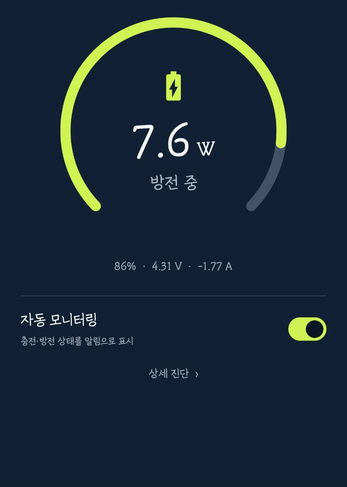
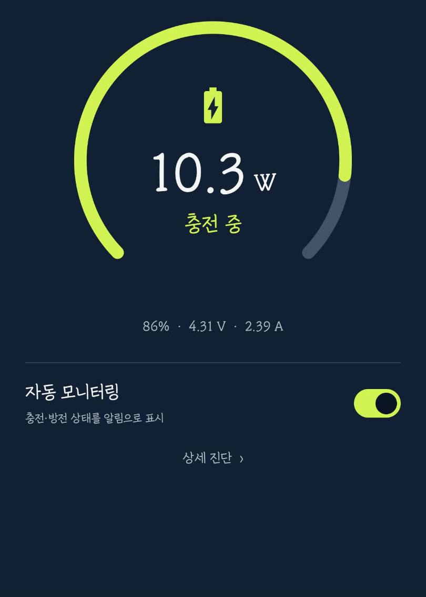
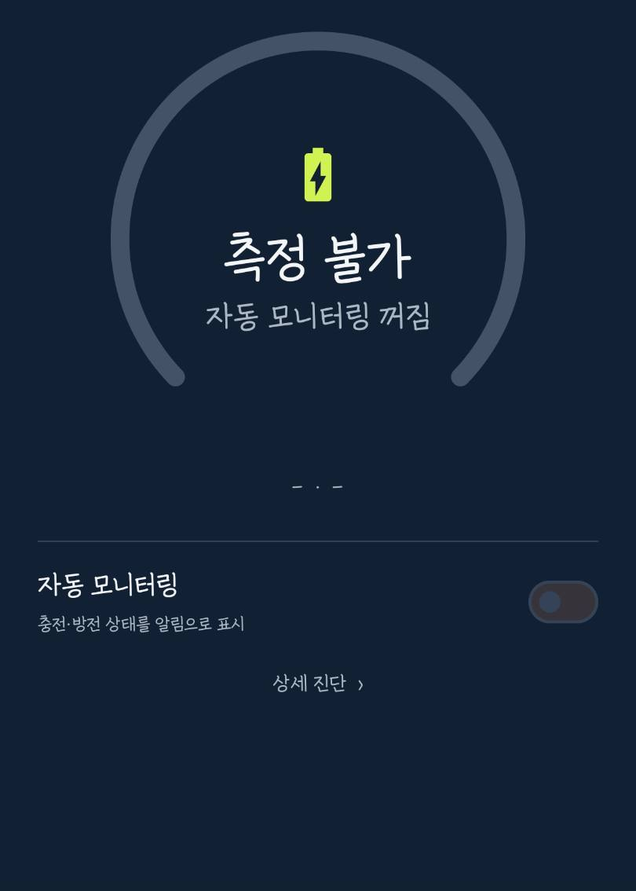
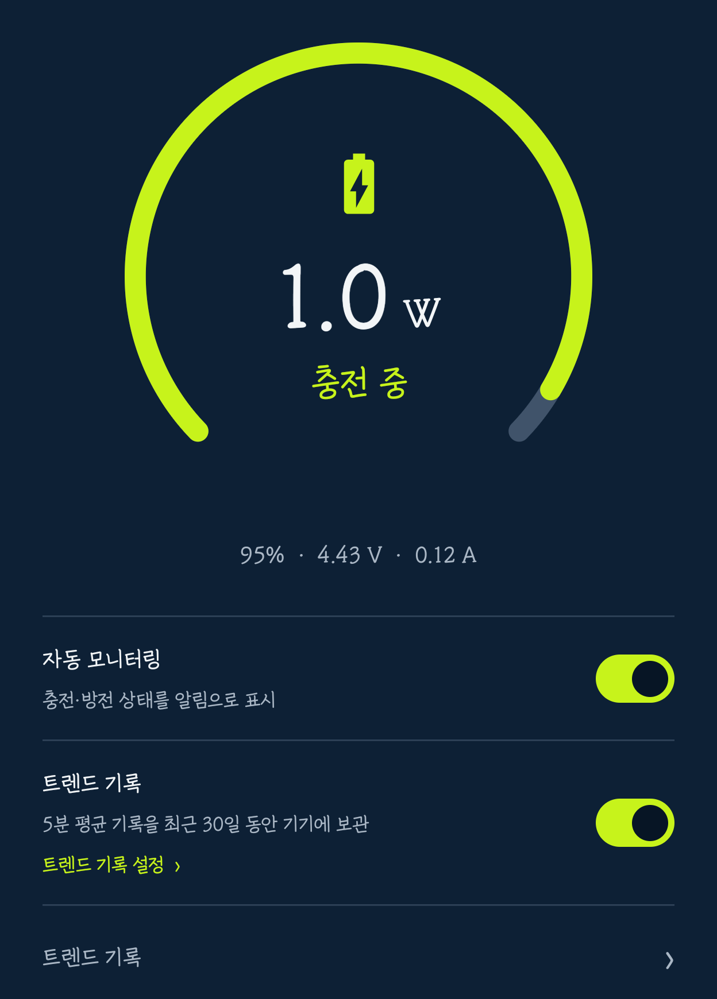
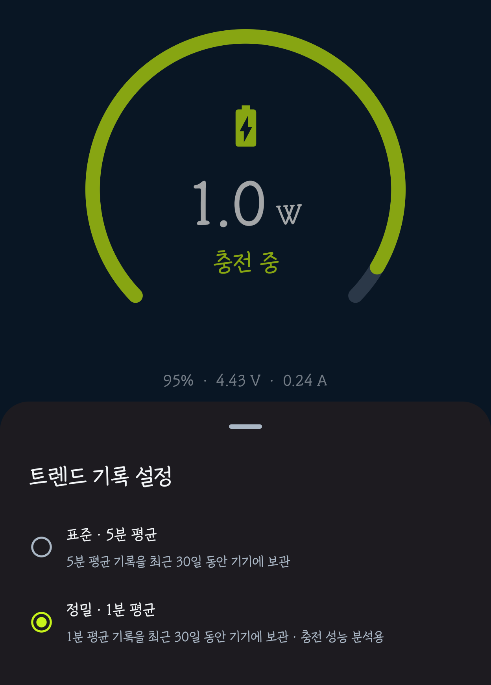

# Charge Monitor

Android 14 이상에서 배터리 전압·전류를 읽어 충전·방전 전력(W)을 계산하고, 지속 알림·빠른 설정 타일·30일 트렌드 기록으로 확인하는 Android 앱입니다.

## 실제 기기 화면

  
  
  

방전 중 · 충전 중 · 자동 모니터링 꺼짐

## 트렌드 기록 설정

  
  

기록 켜기·끄기와 설정 진입을 분리 · 표준 5분 평균 또는 정밀 1분 평균 선택

## 주요 기능

- 충전 중: 현재 충전 전력 표시
- 방전 중: 현재 방전 전력 표시
- 만충: 충전 완료 상태 표시
- 상태바 및 잠금화면 지속 알림
- 빠른 설정 타일에서 현재 와트 확인 및 모니터링 전환
- 선택형 30일 트렌드 기록: 표준 5분 평균 또는 정밀 1분 평균을 선택하고, 기록 주기를 바꿔도 기존 기록을 유지
- 트렌드 그래프를 터치·드래그해 해당 시간의 배터리 잔량과 충전·방전 전력 확인
- 모든 트렌드 기록은 기기 내부에만 최대 30일 보관

## 다운로드

[최신 공개 APK 받기](https://github.com/fullmetalsonic/charge-monitor/releases/latest)

## 문서

- [기획서](docs/01_기획서.md): 목표, 사용자 흐름, 범위, 수용 기준
- [구조 및 파일 분배](docs/02_구조_및_파일분배.md): 향후 Kotlin/Android 모듈 경계
- [결정 및 변경 기록](docs/03_결정_및_변경기록.md): 날짜순 누적 기록
- [개발·검증 루프](docs/04_개발_및_검증_루프.md): Graph Engineering 작업 흐름과 증거 기준

## 문서 운영 규칙

- 요구사항, 기술 판단, 검증 결과, 보류 사항은 `docs/03_결정_및_변경기록.md`의 맨 아래에 날짜와 함께 추가한다.
- 확정된 기능 또는 파일 구조가 바뀌면 해당 기획서·구조 문서도 함께 갱신한다.
- 구현 전 결정되지 않은 항목은 추정으로 고정하지 않고 `보류`로 기록한다.

## 빌드 정보

- Android 14(API 34) 이상, Android 17(API 37) 대상
- Android Gradle Plugin 9.1.1 / Gradle 9.3.1 / JDK 17
- Windows 한글 경로에서는 Gradle의 단위 테스트 워커가 실패할 수 있다. Android Studio에서 열거나, 임시 ASCII 경로에서 `gradlew.bat test assembleDebug lintDebug`를 실행한다.
- 공개 릴리스 APK: GitHub Releases의 `ChargeMonitor-v*.apk`
- 개발용 디버그 APK: `app/build/outputs/apk/debug/app-debug.apk`
